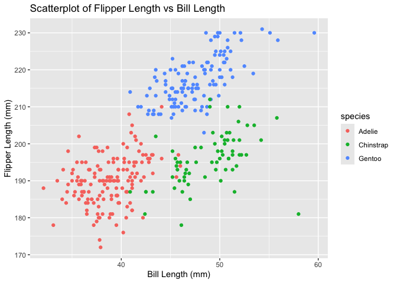

P8105 Homework 1
================

# Problem 1

## Downloading the penguins dataset

## Description of the penguins dataset

The penguins dataset contains information about 344 penguins from three
species: Adelie, Chinstrap, and Gentoo. Important variables include:

- species: Species of the penguin
- island: Island where the penguin was observed
- bill length (mm): Length of the penguin’s bill
- bill depth (mm): Depth of the penguin’s bill
- flipper length (mm): Length of the penguin’s flipper
- body mass (g): Mass of the penguin in grams

The dataset has 344 rows and 8 columns.

The mean flipper length is 200.92 mm.

## Creating a Scatterplot of Flipper Length vs Bill Length

<!-- -->

    ## Saving 7 x 5 in image

# Problem 2

## Creating a Data Frame

``` r
hw_1_df = tibble(
  sample_normal = rnorm(10), 
  vec_logical = sample_normal > 0, 
  vec_char = c("My", "name", "is", "Tamara", "and", "this", "is", "my", "Homework", "1."), 
  vec_factor = factor(sample(c("Low", "Medium", "High"), 10, replace = TRUE))
)
```

## Taking the Mean of Each Variable

``` r
mean(pull(hw_1_df, sample_normal))
```

    ## [1] -0.2679374

``` r
mean(pull(hw_1_df, vec_logical))
```

    ## [1] 0.4

``` r
mean(pull(hw_1_df, vec_char))
```

    ## Warning in mean.default(pull(hw_1_df, vec_char)): argument is not numeric or
    ## logical: returning NA

    ## [1] NA

``` r
mean(pull(hw_1_df, vec_factor))
```

    ## Warning in mean.default(pull(hw_1_df, vec_factor)): argument is not numeric or
    ## logical: returning NA

    ## [1] NA
